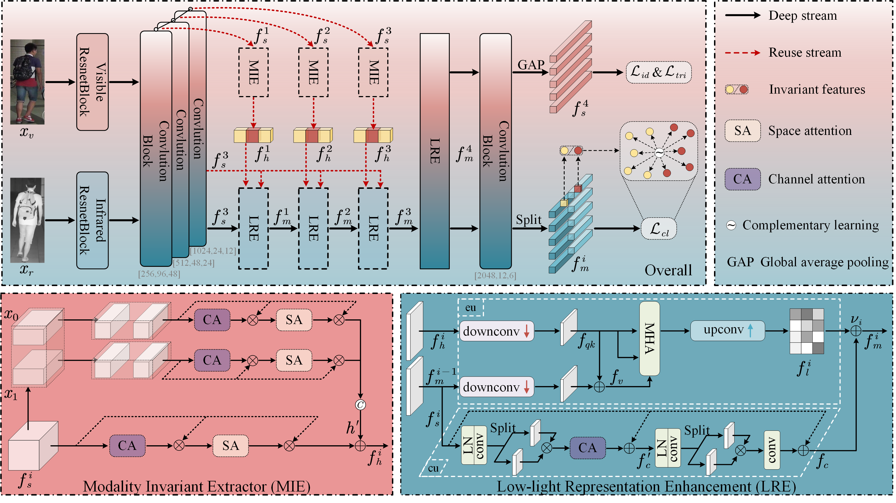

## Low-light Invariant Representation Learning for Visible-Infrared Person Re-identification

Official implementation of paper "<u>Low-light Invariant Representation Learning for Visible-Infrared
Person Re-identification</u>"(**acmmm2025 oral**, [Paper](https://dl.acm.org/doi/10.1145/3746027.3755601)).



### 1. Requirements

Our experiments are conducted under the following environments:

- Python 3.8
- Pytorch == 2.1.2
- torchvision == 0.16.2

### 2. Datasets

- RegDB [1]: The RegDB dataset can be downloaded from this [website](http://dm.dongguk.edu/link.html).

- SYSU-MM01 [2]: The SYSU-MM01 dataset can be downloaded from this [website](http://isee.sysu.edu.cn/project/RGBIRReID.htm).

  - run `python pre_process_sysu.py` to pepare the dataset, the training data will be stored in ".npy" format.

    ```
    python pre_process_sysu.py
    ```

- LLCM [5]: The LLCM dataset can be downloaded by sending a signed [dataset release agreement](https://github.com/ZYK100/LLCM/blob/main/Agreement/LLCM%20DATASET%20RELEASE%20AGREEMENT.pdf) copy to zhangyk@stu.xmu.edu.cn. 


### 3. Training


**Train IRL by**

```
python train.py --dataset sysu --gpu 0
```
- `--dataset`: which dataset "sysu", "regdb" or "llcm".

- `--gpu`: which gpu to run.

*You may need manually define the data path first.*


### 4. Testing

**Test a model on SYSU-MM01 dataset by**

```
python test.py --dataset 'sysu' --mode 'all' --resume 'model_path'  --gpu 0
```
  - `--dataset`: which dataset "sysu" or "regdb".
  - `--mode`: "all" or "indoor"  (only for sysu dataset).
  - `--resume`: the saved model path.
  - `--gpu`: which gpu to use.


**Test a model on RegDB dataset by**

```
python test.py --dataset 'regdb' --resume 'model_path'  --tvsearch True --gpu 0
```

  - `--tvsearch`:  whether thermal to visible search  True or False (only for regdb dataset).


**Test a model on LLCM dataset by**

```
python test.py --dataset 'llcm' --resume 'model_path'  --gpu 0
```


### 5. Results

We adopt the CNN-based AGW [3] as backbone respectively.

| Datasets | Backbone | Rank@1 | Rank@10 |  mAP   |  mINP  |                            Model                             |                              -                               |
| :------: | :------: | :----: | :-----: | :-----: | :----: | :----------------------------------------------------------: | :----------------------------------------------------------: |
|  #LLCM   |   AGW    | 58.39% | 84.75%  | 64.68% | 61.42% | [GoogleDrive](https://drive.google.com/file/d/1F5YerFruoyPwxu0Xdyay9Ts0JJ0NzHnb/view?usp=sharing) | [Baidu Netdisk](https://pan.baidu.com/s/1zUtmo0nzsL9-758MhU2QKQ?pwd=6j64) |

**\*The results may exhibit fluctuations due to random splitting, and further improvement can be achieved by fine-tuning the hyperparameters.**


### 6. Citation

Most of the code of our backbone are borrowed from [AGW](https://github.com/mangye16/Cross-Modal-Re-ID-baseline) [3]. Most of the code related to LLCM dataset are borrowed from [DEEN](https://github.com/ZYK100/LLCM) [5]. 

Thanks a lot for the author's contribution.

**Please cite the following paper in your publications if it is helpful:**:heart:

```
@inproceedings{wang2025low,
  title={Low-light Invariant Representation Learning for Visible-Infrared Person Re-identification},
  author={Wang, Dengwen and Xing, Guanyu and Liu, Yanli},
  booktitle={Proceedings of the 33rd ACM International Conference on Multimedia},
  pages={8645--8653},
  year={2025}
}
```

###  References

[1] D. T. Nguyen, H. G. Hong, K. W. Kim, and K. R. Park. Person recognition system based on a combination of body images from visible light and thermal cameras. Sensors, 17(3):605, 2017.

[2] A. Wu, W.-s. Zheng, H.-X. Yu, S. Gong, and J. Lai. Rgb-infrared crossmodality person re-identification. In IEEE International Conference on Computer Vision (ICCV), pages 5380–5389, 2017.

[3] Ye M, Shen J, Lin G, et al. Deep learning for person re-identification: A survey and outlook[J]. IEEE transactions on pattern analysis and machine intelligence, 2021, 44(6): 2872-2893.

[4] Ye M, Ruan W, Du B, et al. Channel augmented joint learning for visible-infrared recognition[C]//Proceedings of the IEEE/CVF International Conference on Computer Vision. 2021: 13567-13576.

[5] Zhang Y, Wang H. Diverse Embedding Expansion Network and Low-Light Cross-Modality Benchmark for Visible-Infrared Person Re-identification[C]//Proceedings of the IEEE/CVF Conference on Computer Vision and Pattern Recognition. 2023: 2153-2162.